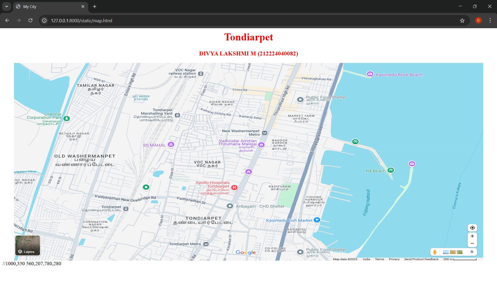
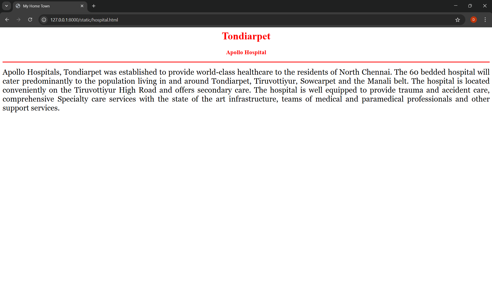
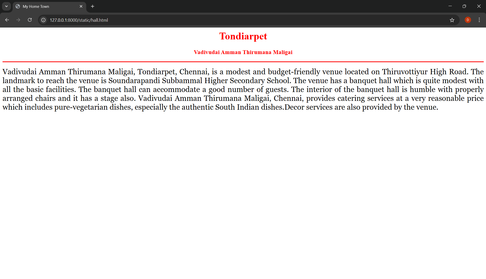
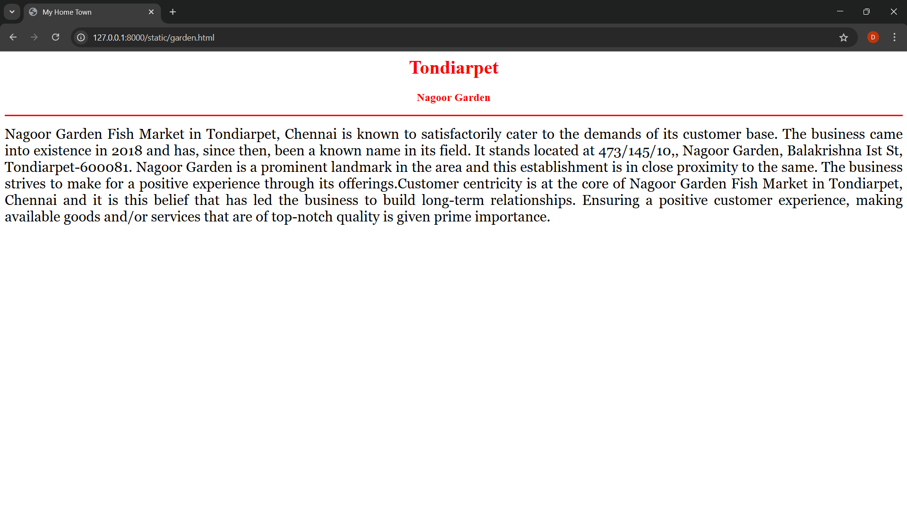
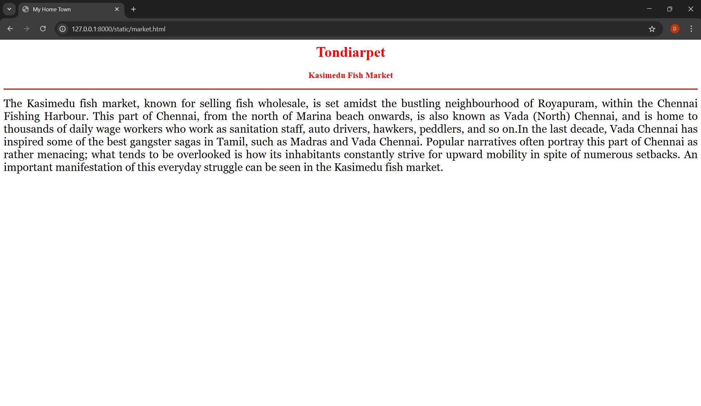
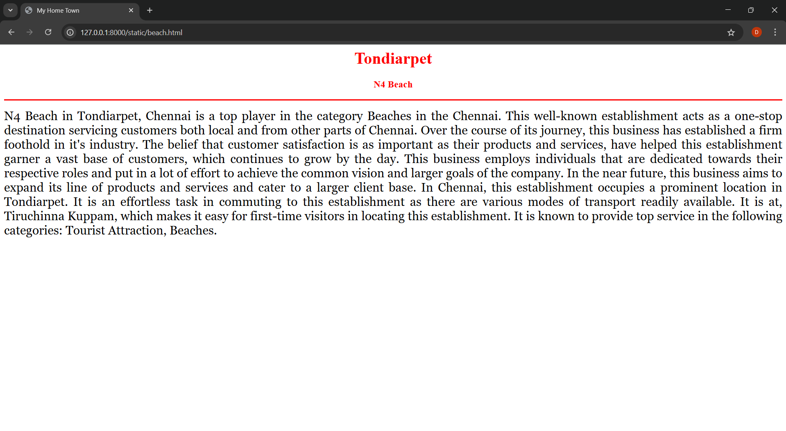

# Ex04 Places Around Me
## Date: 20.04.2025

## AIM
To develop a website to display details about the places around my house.

## DESIGN STEPS

### STEP 1
Create a Django admin interface.

### STEP 2
Download your city map from Google.

### STEP 3
Using ```<map>``` tag name the map.

### STEP 4
Create clickable regions in the image using ```<area>``` tag.

### STEP 5
Write HTML programs for all the regions identified.

### STEP 6
Execute the programs and publish them.

## CODE
```
map.html

<html>
    <head>
        <title>
            My City
        </title>
    </head>
    <body>
        <h1 align="center">
            <font color="red"><b>Tondiarpet</b></font>
        </h1>
        <h3 align="center">
            <font color="red"><b>DIVYA LAKSHMI M (212224040082)</b></font>
        </h3>
        <center>
            
            <map name="MyCity">
                <area shape="rect" coords="2000,200,1000,350" href="beach.html" title="N4 beach">
                <area shape="rect" coords="686,250,836,196" href="hall.html" title="Vadivudai Amman Thirumana Maligai">
                <area shape="rect" coords="581,341,682,453" href="hospital.html" title="Apollo hospital">
                <area shape="rect" coords="850,1100,1000,408" href="market.html" title="Kasimedu fish market">
                <area shape="rect" coords="760,207,853,358" href="garden.html" title="Nagoor garden">
            </map>
        </center>
    </body>
</html>

beach.html

<html>
    <head>
        <title>My Home Town</title>
    </head>
    <body>
        <h1 align="center">
            <font color="red"><b>Tondiarpet</b></font>
        </h1>
        <h3 align="center">
            <font color="red"><b></b>N4 Beach</font>
        </h3>
        <hr size="3" color="red">
        <p align="justify">
            <font face="georgia" size="5">
                N4 Beach in Tondiarpet, Chennai is a top player in the category Beaches in the Chennai. 
                This well-known establishment acts as a one-stop destination servicing customers both local and from other parts of 
                Chennai. Over the course of its journey, this business has established a firm foothold in it's industry. 
                The belief that customer satisfaction is as important as their products and services, have helped this establishment
                garner a vast base of customers, which continues to grow by the day. This business employs individuals that are 
                dedicated towards their respective roles and put in a lot of effort to achieve the common vision and larger goals 
                of the company. In the near future, this business aims to expand its line of products and services and cater to a 
                larger client base. In Chennai, this establishment occupies a prominent location in Tondiarpet. 
                It is an effortless task in commuting to this establishment as there are various modes of transport readily available. 
                It is at, Tiruchinna Kuppam, which makes it easy for first-time visitors in locating this establishment. 
                It is known to provide top service in the following categories: Tourist Attraction, Beaches.
            </font>
        </p>
    </body>
</html>

hospital.html

<html>
    <head>
        <title>My Home Town</title>
    </head>
    <body>
        <h1 align="center">
            <font color="red"><b>Tondiarpet</b></font>
        </h1>
        <h3 align="center">
            <font color="red"><b>Apollo Hospital</b></font>
        </h3>
        <hr size="3" color="red">
        <p align="justify">
            <font face="georgia" size="5">
                Apollo Hospitals, Tondiarpet was established to provide world-class healthcare to the residents of North Chennai. 
                The 60 bedded hospital will cater predominantly to the population living in and around Tondiarpet, Tiruvottiyur, 
                Sowcarpet and the Manali belt. The hospital is located conveniently on the Tiruvottiyur High Road and offers 
                secondary care. The hospital is well equipped to provide trauma and accident care, comprehensive Specialty care 
                services with the state of the art infrastructure, teams of medical and paramedical professionals and other support 
                services.
            </font>
        </p>
    </body>
</html>

garden.html

<html>
    <head>
        <title>My Home Town</title>
    </head>
    <body>
        <h1 align="center">
            <font color="red"><b>Tondiarpet</b></font>
        </h1>
        <h3 align="center">
            <font color="red"><b>Nagoor Garden</b></font>
        </h3>
        <hr size="3" color="red">
        <p align="justify">
            <font face="georgia" size="5">
                Nagoor Garden Fish Market in Tondiarpet, Chennai is known to satisfactorily cater to the demands of its customer base. 
                The business came into existence in 2018 and has, since then, been a known name in its field. 
                It stands located at 473/145/10,, Nagoor Garden, Balakrishna Ist St, Tondiarpet-600081. 
                Nagoor Garden is a prominent landmark in the area and this establishment is in close proximity to the same. 
                The business strives to make for a positive experience through its offerings.Customer centricity is at the core of 
                Nagoor Garden Fish Market in Tondiarpet, Chennai and it is this belief that has led the business to build long-term 
                relationships. Ensuring a positive customer experience, making available goods and/or services that are of top-notch 
                quality is given prime importance.

            </font>
        </p>
    </body>
</html>

market.html

<html>
    <head>
        <title>My Home Town</title>
    </head>
    <body>
        <h1 align="center">
            <font color="red"><b>Tondiarpet</b></font>
        </h1>
        <h3 align="center">
            <font color="red"><b>Kasimedu Fish Market</b></font>
        </h3>
        <hr size="3" color="red">
        <p align="justify">
            <font face="georgia" size="5">
                The Kasimedu fish market, known for selling fish wholesale, is set amidst the bustling neighbourhood of Royapuram, 
                within the Chennai Fishing Harbour. This part of Chennai, from the north of Marina beach onwards, is also known as
                Vada (North) Chennai, and is home to thousands of daily wage workers who work as sanitation staff, auto drivers, hawkers, 
                peddlers, and so on.In the last decade, Vada Chennai has inspired some of the best gangster sagas in Tamil, such as Madras and Vada Chennai. 
                Popular narratives often portray this part of Chennai as rather menacing; what tends to be overlooked is how its 
                inhabitants constantly strive for upward mobility in spite of numerous setbacks. An important manifestation of this 
                everyday struggle can be seen in the Kasimedu fish market.
            </font>
        </p>
    </body>
</html>

hall.html

<html>
    <head>
        <title>My Home Town</title>
    </head>
    <body>
        <h1 align="center">
            <font color="red"><b>Tondiarpet</b></font>
        </h1>
        <h3 align="center">
            <font color="red"><b>Vadivudai Amman Thirumana Maligai</b></font>
        </h3>
        <hr size="3" color="red">
        <p align="justify">
            <font face="georgia" size="5">
                Vadivudai Amman Thirumana Maligai, Tondiarpet, Chennai, is a modest and budget-friendly venue located on Thiruvottiyur High Road. 
                The landmark to reach the venue is Soundarapandi Subbammal Higher Secondary School. 
                The venue has a banquet hall which is quite modest with all the basic facilities. 
                The banquet hall can accommodate a good number of guests.
                The interior of the banquet hall is humble with properly arranged chairs and it has a stage also.
                Vadivudai Amman Thirumana Maligai, Chennai, provides catering services at a very reasonable price which includes pure-vegetarian dishes, 
                especially the authentic South Indian dishes.Decor services are also provided by the venue. 
            </font>
        </p>
    </body>
</html>

```


## OUTPUT












## RESULT
The program for implementing image maps using HTML is executed successfully.
